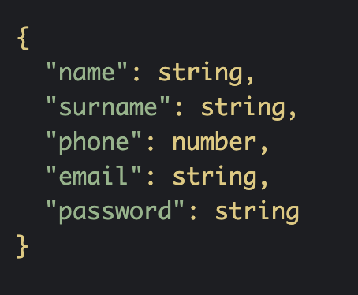
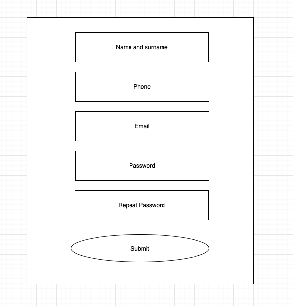

# Form for TalentFY

## Goals
- In this repository, you will see a form created with JavaScript.

- [Demo](#demo)

## Installation

- Run the following commands:
```
git clone git@github.com:Juliiis/form-for-talentfy.git
cd form-for-talentfy

```
## Requirements

- In the case of the name, the data must be sent as "name" and "surname" assuming that the first word is the "name" and the others the "surname" (EJ: "User Name". "Name" = " Name "," surname "=" of the User ").
- The email must be valid.
- The phone must have 9 digits.
- The name cannot contain numbers.
- Passwords must be the same.
- In case a validation fails, show the error.
- The style of the form is free, it can be done with CSS or SCSS.


## Demo
- Data structure:



- Final result:



## Notes
- This is a project that was created for TalentFY, Barcelona.

